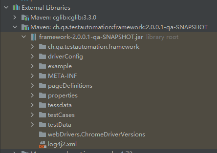

# Framework:

## Start up

> First, ensure that the framework is deployed on known Repository in or out of local system.

#### For Example - Maven users:

#### Add this block to `pom.xml`:

```xml
<dependency>
    <groupId>ch.qa.test.automation</groupId>
    <artifactId>framework</artifactId>
    <version>2.1.0.0-qa-SNAPSHOT</version>
</dependency>
```

### Environment Requirement

* Java JDK 11 or above
* [Allure Framework](https://github.com/allure-framework/allure2/releases) for report generation

#### Allure Setup (Windows)
* download the zip file of the actual release (2.1x.x)
* unpack to local dir and add the root dir path of allure to environment variable with name "ALLURE_HOME"
* add "%ALLURE_HOME%\bin" to path in environment variable
* verify allure with cmd command: allure --version

### Resources of Framework
> copy necessary example and or property files to local resources folder
* several driver configs in Dir "driverConfig"
* test case files in dir "example"
* property files in dir "properties"
* test data files in dir "testData"



> Note that, the property file contains all important keys of settings of framework. Change it per demand 

### [Version Stack](VersionStack)

## References
* [Selenide](Selenide-Home)
* [slf4j](slf4j)
* [Snippets](Snippets)
* [SoftAssertion](SoftAssertions)
* [Safari](Safari)
* [Build Script](Build-script)
* [Custom Conditions](Custom-conditions)
